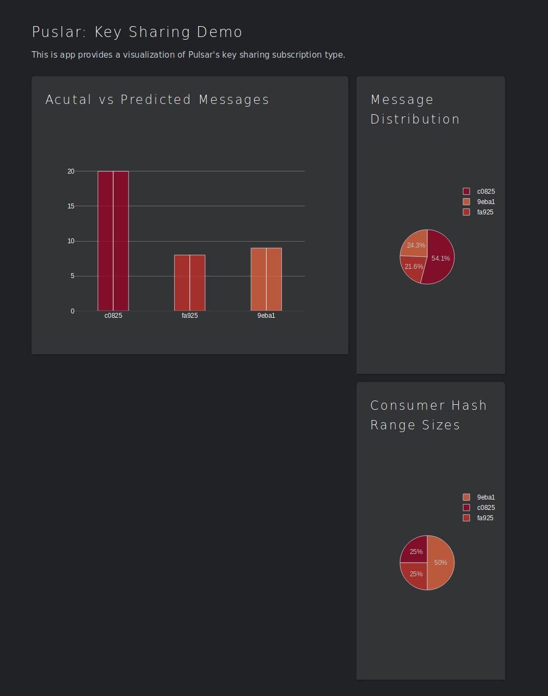

# Testing Pulsar's Key_Shared back-end

## About
The goal of the repository is to test exactly how Pulsar's `Key_Shared` subscription is implemented. To do this the back-end (broker side) code needs to be replicated. This requires a dive into the `Key_Shared` pull request and Pulsar Admin API. 

The dashboard for this test visualizes which consumer receives each message (via bar and pie graph) and how the hash ranges are allocated to each consumer (via pie graph). The majority of the `Key_Shared` replication code is located in `PseudoStream.java`. 

To see what a practical, yet trivial, application `Key_Shared` see the repository [pulsar-stateful-demo](https://github.com/Bpoole908/pulsar-statful-demo). 

**Note:** This a legacy repository and was devolved to build  [pulsar-stateful-demo](https://github.com/Bpoole908/pulsar-statful-demo) repository. Code may not be well maintained (could have potential minor bugs), but should be functional.  

## Running via Docker Images

### Requirements
- Docker 
	- For start-up and creation of Docker images.
- Docker Compose
	- For easy start-up of multiple images/containers.

To run the test the first thing you'll have to do is build or pull the test images. By default, running the docker compose file will automatically pull the images from my personal docker hub if they are not found locally. If you want to build your own images see Building Images section below. If for some reason the docker images are not automatically pulled they can be found here: [Python](https://hub.docker.com/r/bpoole908/key-shared-test-python) and [Java](https://hub.docker.com/r/bpoole908/key-shared-test-java) images.

Since we are using Docker images the requirements for running the test are simply Docker and Docker Compose, although there are many more required packages working behind the scenes (thus is the beauty of Docker images). If your interested in the environment the Java and Python image creates check out `images/Dockerfile-java` and `image/Dockerfile-python` files.

The easiest way to run the `docker-compose.yml`file on Linux is to `source ./env.sh` and use the given aliases.  If you are not using Linux simply use the full docker-compose commands instead of the aliases (adapt as needed for your OS). Below are the aliases provided by the script `./env.sh` script. 
```
alias up="docker-compose up -d"
alias stop="docker-compose stop"
alias down="docker-compose down -v"
alias devup="docker-compose -f docker-compose-dev.yml up -d"
alias devstop="docker-compose -f docker-compose-dev.yml stop"
alias devdown="docker-compose -f docker-compose-dev.yml down -v"
```
To run  `docker-compose.yml` simply run the `up` command.  Before doing so make sure you have configured the `docker-compose.yml` as needed. If you do not have a beefy PC make sure to scale down the number of consumers produced (the `scale` variable controls the number of consumer containers created,  defaults to 3) This will start all the containers as daemons. Using the `stop` command will stop all the containers, but will not tear them down. On the other hand, the `down` command will tear down all containers (the `-v` flag cleans up all volumes, which is needed to delete messages left inside Pulsar's topics).

Once you have started the test with the `up` command it will take between 30 and 60 seconds for all the containers to successfully start and connect to the Pulsar client.  In the mean time, you can use `docker logs -f <container name>` to observe the logs and monitor a container's health. When a container successfully connects you should see the following message `CONNECTED: - Topic: <topic name>`.

In the meantime if you want to load the dashboard simply connect to the IP [http://localhost:8050/](http://localhost:8050/). You'll need to keep refreshing the dashboard until the Pulsar consumer within the dashboard has connected. Once all the containers are connected to the client messages will begin to flow. You can tell the test is working if the empty dashboard begins plotting the consumer names and their messages received. 

If you want to test what happens when a consumer is dropped run the following command.

`docker stop <consumer container>`

Then to see what happens when the consumer is brought back online run the following command.

`docker start <stopped consumer container>`

Lastly, if you want to test adding a new container simply change the value of `scale` in the docker-compose under the `consumer` service. Note, make sure the new value that is greater than the previous value. Then run the `up` command, this will update the number of consumer containers.

The test ends when the messages produced has exceed the message limit given in the docker-compose (`N_MESSAGES` variable controls number of produced messages, default 100). To end the test use the `down` command to tear down all the containers and then **refresh or exit** the dashboard window to clear the dashboard's memory stores. Running the test back-to-back without clearing the memory can lead to unintended behaviors with Dash.



## Running the Dev Environment
###  Requirements
- Docker 
	- For start-up and creation of Docker images.
- Docker Compose
	- For easy start-up of multiple images/containers.
- Java 8
	- For compiling
- Maven 3.6.x
	- For compiling and assembling requirements 

For Linux users that wish to actively edit and change the code I suggest using the `docker-compose-dev.yml` file. This will mount all the code into the containers and your local .m2 Maven repository so that you do not need to constantly rebuild images (this assumes your .m2 folder is in you HOME directory and the `pwd` command is available).

The first thing we need to do is make sure Maven has built all dependencies and compiled the most recent version of the code. We can do this by running `mvn clean package`, which will create a directory called `target/`. The `target/` directory will be directly mounted into the Java containers. Any time you edit the Java files you will need to rerun `mvn clean package`.

Next, we'll want to run `source ./env.sh` . Once again, this will create a less tedious aliases for running, stopping, and bringing down the dev environment . The development environment corresponds to the `devup`, `devstop` and `devdown` commands, which function similarly to `up`, `stop` and `down`.  For more details on these commands see Running via Docker Images section above.

Now we can run the the dev environment using `devup`. Everything else from here on will function just like in the Running via Docker Images section.

## Building Images
There are two images a Python and a Java image. The Python image builds the environment for  the `dashboard/` scripts. On the other hand, the Java image builds the environment for the creator (producer) and collector (consumer).

### Linux 
Linux users can build the images with the ./build-images script. Simply run `./build-images <python or java> <image name>`.  If you change the name of the image be sure to change the image name in the docker compose file.

#### Format
`./build-images <java or python> <image name>`

#### Build Java Example
`./build-images java key-shared-test-java:latest`

#### Build Python Example
`./build-images python key-shared-test-python:latest`

### Other Platforms 

If you can't run the above script you can simply use the Docker build command.
 `docker build -f images/Dockerfile-<java or python> -t <image tag> .`
